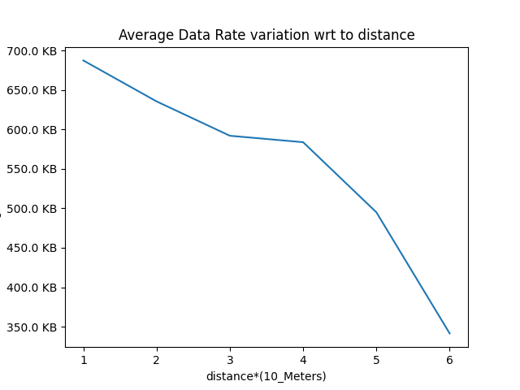

# Data Rate Analysis between WiFi Devices

## Overview

This project explores the performance of WiFi communication between NodeMCUs and Raspberry Pis under various conditions. The experiments include data rate observations in different environments, ad-hoc networking with Raspberry Pis, and the use of WiFi adapters to extend transmission range.

## Contents

1. [NodeMCU Experiment](#nodemcu-experiment)
2. [Raspberry Pi Experiments](#raspberry-pi-experiments)
3. [WiFi Adapter Experiment](#wifi-adapter-experiment)
4. [Next Steps](#potential-next-steps)
5. [Conclusion](#conclusion)
6. [Project Image](#project-image)

## NodeMCU Experiment

- **Setup:** Connect two NodeMCUs named server and client.
- **Data Transfer:** Send data from server to client.
- **Observations:** Study data rate drops in different environmental conditions and ranges.

## Raspberry Pi Experiments

- **Ad-hoc Network:** Set up one Raspberry Pi as an ad-hoc network and connect another Raspberry Pi.
- **Data Transfer:** Send large data (videos) and observe data rates in relation to range.
- **Observations:** Analyze data rates based on the varying conditions.

## WiFi Adapter Experiment

- **Setup:** Connect a WiFi adapter to a Raspberry Pi to extend the transmission range.
- **Data Transfer:** Send data with the extended range.
- **Observations:** Observe variations in data rates with increased distance.

## Potential Next Steps

1. **Analysis:** Analyze collected data to identify patterns and trends.
2. **Comparison:** Compare data rates between NodeMCUs and Raspberry Pis.
3. **Optimization:** Explore ways to optimize data rates.
4. **Documentation:** Document methodologies, results, and challenges faced.

## Conclusion

Summarize key insights, lessons learned, and areas for future improvement.

## Project Image

